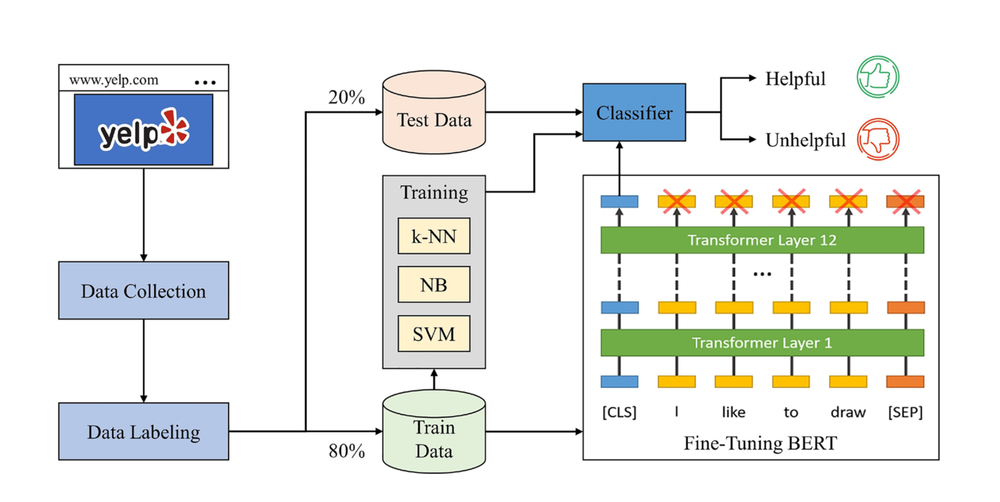

# HP-BERT - Helpfulness Prediction BERT

*Bilal, M., & Almazroi, A. A. (2023). Effectiveness of fine-tuned BERT model in classification of helpful and unhelpful online customer reviews. Electronic Commerce Research, 23, 2737-2757.*

## 개요
HP-BERT는 사전학습 언어모델 BERT를 활용하여 리뷰 유용성 분류 성능을 유의미하게 개선함을 Yelp 리뷰 데이터셋을 통해 입증한 모델이다. 본 구현에서는 Steam 리뷰 도메인에 적용하기 위해 BERT 인코더를 frozen 상태로 두고, 사전학습 의미 표현을 회귀 task에 그대로 활용한다.

## 입력 모달리티
- 단일 텍스트 모달리티 (리뷰 텍스트)
- 토큰화: bert-base-uncased tokenizer
- 시퀀스 길이: 최대 256 토큰 (padding / truncation)

## 아키텍처
1. BERT 인코더 (frozen)
   - 12층 Transformer Encoder, bert-base-uncased
   - 본 프로젝트와 Yelp 데이터의 도메인 차이를 고려하여 Yelp fine-tuned 가중치를 사용하지 않음
   - 가중치 frozen, torch.no_grad() 환경에서 순전파만 수행
   - 추가 학습 파라미터 없이 대규모 사전학습 의미 표현만 보존적으로 활용

2. [CLS] 표현 추출
   - self-attention 기반 양방향 문맥 정보를 압축한 [CLS] 토큰의 pooler_output
   - 마지막 hidden state에 tanh 활성을 거친 표현
   - 768차원 벡터로 한 리뷰의 통합 표현 확보

## 회귀 헤드
- Dropout
- Dense(1, linear)

## 타깃
- target = log(votes_up + 1)

## 코드
- 구현 파일: `03_BERT_nomans.py`
- 실행 절차: BERT [CLS] 임베딩 사전 추출 -> grid search (5 lr x 3 dropout x 3 batch = 45조합) -> best 조합 10회 반복 (fixed42 5회 + varied 5회)
