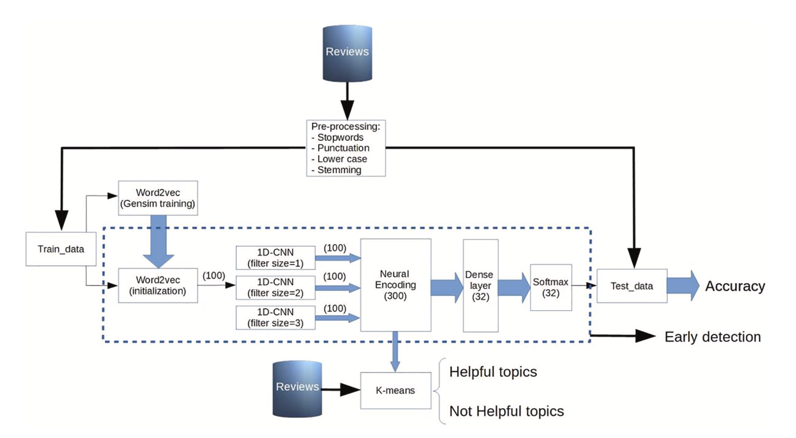

<h1>TNN - Text-based 1D Convolutional Neural Network</h1>

<h2>🏛️Arcchitecture</h2>

  

  <i>Olmedilla, M., Martinez-Torres, M. R., & Toral, S. (2022). Prediction and modelling online reviews helpfulness using 1D Convolutional Neural Networks. Expert Systems with Applications, 198, 116787.</i>

<h2>🔎Overview</h2>

- TNN은 전통적 1D CNN, 즉 다양한 kernel size의 병렬
합성곱이 텍스트 모달리티의 의미 패턴을 포착할 수 있음을 입증한 모델임. 
- 본 구현에서는 Steam 리뷰 데이터에 동일 구조를 적용해 리뷰 유용성(votes_up)을 회귀한다.

<h2>🔧Using tool</h2>

* <code>Python 3.10-3.12</code>
* <code>tensorflow==2.18.1</code>
* <code>gensim>=4.3.0</code>
* <code>nltk>=3.8.0</code>
* <code>scikit-learn>=1.3</code>
* <code>numpy&lt;2.0</code>
* <code>pandas>=2.0</code>
* <code>scipy</code>
* <code>tqdm</code>

<h2>🎯Target</h2>

   * 학습 타깃:
      원시 votes_up 값을 안정적으로 회귀하기 위해 로그 변환 적용 -> <code>log(votes_up + 1)</code>
   * q99 cutoff:
      long-tail 영향을 줄이기 위해 train split에 한해 99 퍼센타일을 초과하는 샘플 제거
   * 데이터 누수 방지:
      q99 cutoff는 train split에만 적용, validation/test에는 미적용

<h2>📝Architecture Details</h2>
   
   <h3>1) Embedding Single Text Modality</h3>

   * 입력 데이터:
      단일 텍스트 모달리티(리뷰 텍스트)를 입력으로 사용
   * 토큰화 및 임베딩:
      NLTK tokenizer로 리뷰 텍스트를 토큰화한 후, 100차원 Word2Vec으로 초기화된 Embedding layer를 통과시켜 임베딩 행렬 구성

   

   <h3>2) Parallel 1D Conv (3 branch)</h3>

   * 합성곱 구조:
      동일 임베딩 행렬에 kernel size 1, 2, 3의 Conv1D 세 개를 병렬로 적용
   * 필터 구성:
      각 branch당 100개 필터, ReLU 활성화 함수 적용
   * 추출 패턴:
      개별 단어 / 인접 두 단어 / 세 단어 범위의 지역적 패턴을 동시에 추출

   <h3>3) GlobalMaxPooling1D + Concat</h3>

   * 풀링 방식:
      각 branch 출력에 GlobalMaxPooling1D를 적용하여 가장 큰 활성화 값만 추출
   * 효과:
      리뷰 전체에서 각 필터가 가장 강하게 반응한 위치의 신호만 단일 벡터로 압축
   * 결합:
      세 개의 100차원 pooled 벡터를 이어붙여 300차원 통합 벡터 구성

   

   <h3>4) Regression Head</h3>

   * 적용 순서:
      Dropout -> Dense(32, ReLU) -> Dropout -> Dense(1, linear)
   * 역할:
      중간 Dense layer가 차원 축소 및 비선형성을 부여하고, 마지막 linear layer가 유용성 점수를 출력

